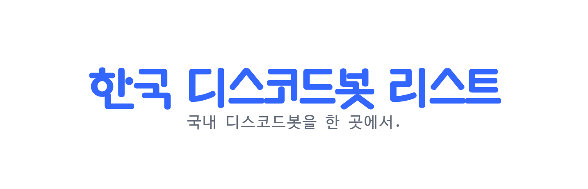

  
  <!-- ALL-CONTRIBUTORS-BADGE:START - Do not remove or modify this section -->
<!-- ALL-CONTRIBUTORS-BADGE:END -->

[Introduced in English](./README.en.md)

> 국내 디스코드봇을 한곳에서.

# SNS

- [Twitter](https://twitter.com/koreanbots)
- [Instagram](https://instagram.com/koreanbots)

# 문의

- [개발자 이메일](mailto:wonderlandpark@callisto.team)
- [디스코드](https://discord.gg/JEh53MQ)

# 기여하기

이슈와 PR은 언제든지 환영입니다.

[기여 규칙](./.github/CONTRIBUTING)

## 기여자

<!-- ALL-CONTRIBUTORS-LIST:START - Do not remove or modify this section -->
<!-- prettier-ignore-start -->
<!-- markdownlint-disable -->
<table>
  <tr>
    <td align="center"><a href="https://wonder.im"> <b>Junseo Park</b></a> <a href="#maintenance-wonderlandpark" title="Maintenance">🚧</a> <a href="#business-wonderlandpark" title="Business development">💼</a></td>
    <td align="center"><a href="https://github.com/zero734kr"> <b>zero734kr</b></a> <a href="https://github.com/koreanbots/koreanbots/pulls?q=is%3Apr+reviewed-by%3Azero734kr" title="Reviewed Pull Requests">👀</a></td>
  </tr>
</table>

<!-- markdownlint-restore -->
<!-- prettier-ignore-end -->

<!-- ALL-CONTRIBUTORS-LIST:END -->
